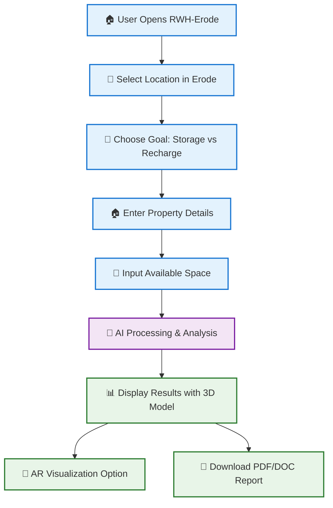
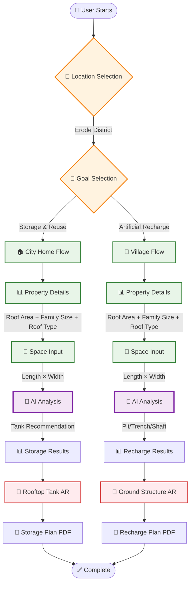
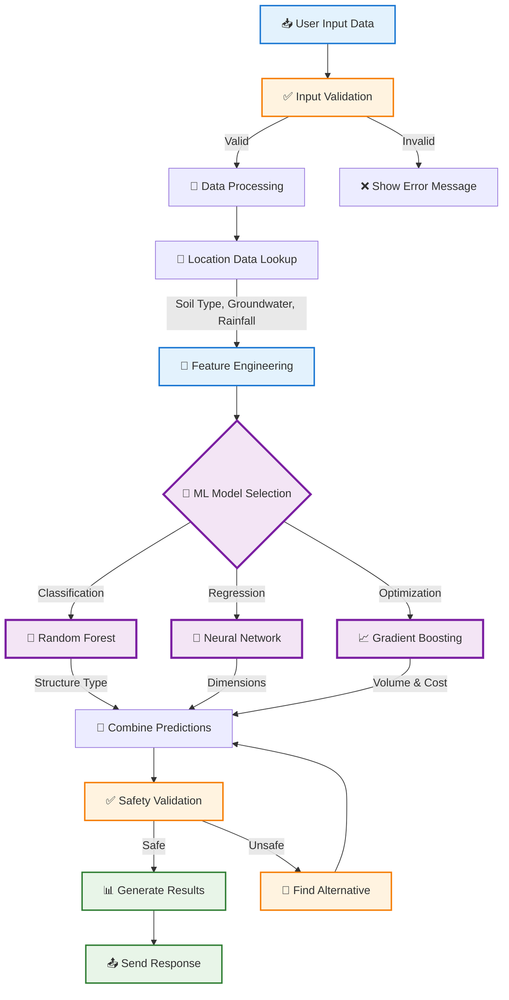
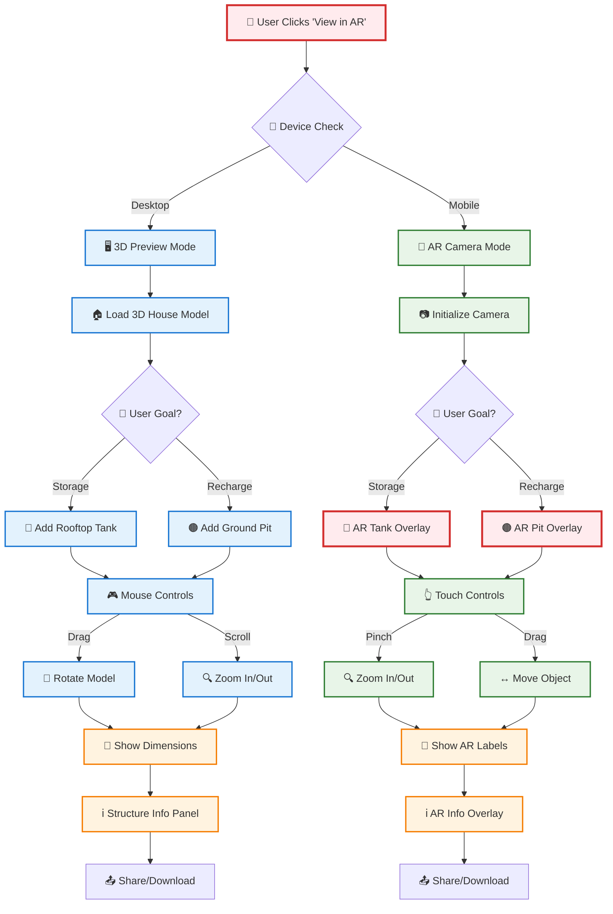
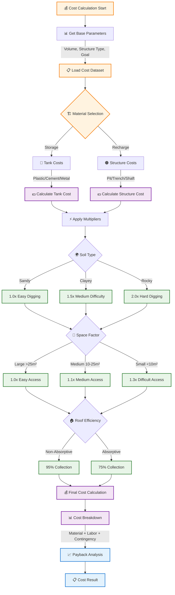
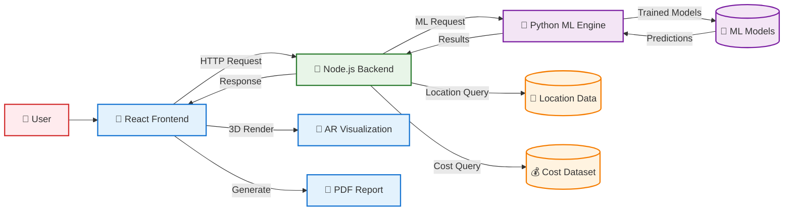
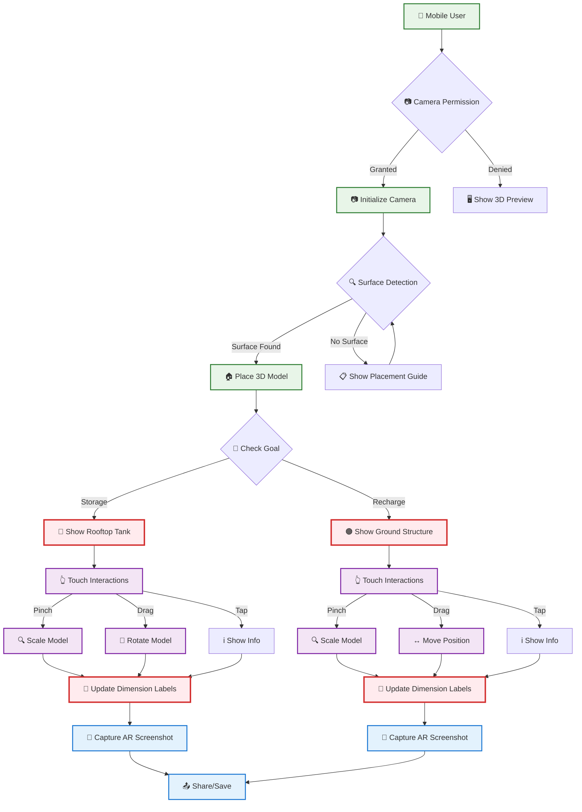
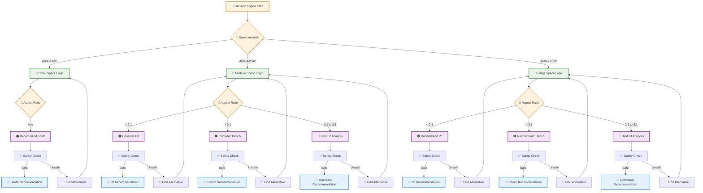
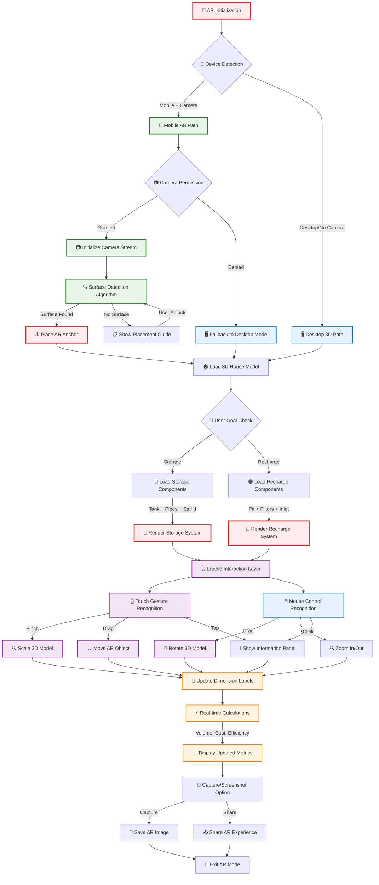

# 📊 Complete Flowcharts - RWH-Erode Project

## 🎯 Main System Workflow

## 🔄 Detailed User Journey Flow

## 🧠 AI Processing Workflow

## 🥽 AR Visualization Workflow

## 💰 Cost Calculation Workflow

## 🔄 System Architecture Flow

## 📱 Mobile AR Workflow

## 🎯 Decision Making Algorithm Flow

## 📊 Data Processing Pipeline

## 🎮 AR Interaction Flowchart (Detailed)

## 🔄 Complete System Integration Flow

```mermaid
graph TD
    UserStart[👤 User Opens App] --> Frontend[🎨 React Frontend Loads]
    Frontend --> |Component Mount| InitState[🔄 Initialize App State]

    InitState --> LocationStep[📍 Location Selection Step]
    LocationStep --> |User Selects| GoalStep[🎯 Goal Selection Step]
    GoalStep --> |Storage/Recharge| PropertyStep[🏠 Property Input Step]
    PropertyStep --> |Roof + Family + Type| SpaceStep[📏 Space Input Step]

    SpaceStep --> |Dimensions Entered| ValidationFE[✅ Frontend Validation]
    ValidationFE --> |Valid| APICall[📡 API Call to Backend]
    ValidationFE --> |Invalid| ShowError[❌ Show Validation Error]

    APICall --> |HTTP POST| BackendReceive[🔧 Backend Receives Request]
    BackendReceive --> ValidationBE[✅ Backend Validation]

    ValidationBE --> |Valid| LocationLookup[📍 Location Data Lookup]
    ValidationBE --> |Invalid| ErrorResponse[❌ Send Error Response]

    LocationLookup --> |Soil, Groundwater, Rainfall| FeatureEng[🔧 Feature Engineering]
    FeatureEng --> |Processed Data| MLAPICall[🧠 Call ML API]

    MLAPICall --> |HTTP POST| MLReceive[🐍 Python ML API Receives]
    MLReceive --> ModelLoad[🤖 Load Trained Models]

    ModelLoad --> Prediction1[🌳 Random Forest Prediction]
    ModelLoad --> Prediction2[🧠 Neural Network Prediction]
    ModelLoad --> Prediction3[📈 Gradient Boosting Prediction]

    Prediction1 --> |Structure Type| CombineResults[🔄 Combine ML Results]
    Prediction2 --> |Dimensions| CombineResults
    Prediction3 --> |Volume & Metrics| CombineResults

    CombineResults --> SafetyCheck[✅ Safety Validation]
    SafetyCheck --> |Safe| MLResponse[📤 Send ML Response]
    SafetyCheck --> |Unsafe| FindAlternative[🔄 Find Alternative Solution]

    FindAlternative --> CombineResults
    MLResponse --> |JSON Response| BackendProcess[🔧 Backend Processing]

    BackendProcess --> CostCalc[💰 Cost Calculation]
    CostCalc --> |Dataset Lookup| FinalResponse[📊 Prepare Final Response]

    FinalResponse --> |HTTP Response| FrontendReceive[🎨 Frontend Receives Results]
    FrontendReceive --> StateUpdate[🔄 Update React State]

    StateUpdate --> RenderResults[📊 Render Results Component]
    RenderResults --> |User Clicks AR| InitAR[🥽 Initialize AR Component]

    InitAR --> Load3D[🏠 Load Three.js 3D Scene]
    Load3D --> |Goal-based| AddStructure[🏗️ Add Structure to Scene]
    AddStructure --> EnableControls[🎮 Enable User Controls]

    EnableControls --> |User Interacts| UpdateScene[🔄 Update 3D Scene]
    UpdateScene --> |Real-time| RecalcMetrics[⚡ Recalculate Metrics]
    RecalcMetrics --> |Updated Values| DisplayUpdate[📊 Update Display]

    DisplayUpdate --> |User Downloads| GeneratePDF[📄 Generate PDF Report]
    GeneratePDF --> |Complete| UserComplete[✅ User Journey Complete]

    %% Styling
    classDef frontend fill:#e3f2fd,stroke:#1976d2,stroke-width:2px
    classDef backend fill:#e8f5e8,stroke:#2e7d32,stroke-width:2px
    classDef ml fill:#f3e5f5,stroke:#7b1fa2,stroke-width:3px
    classDef ar fill:#ffebee,stroke:#d32f2f,stroke-width:2px
    classDef process fill:#fff3e0,stroke:#f57c00,stroke-width:2px

    class UserStart,Frontend,InitState,LocationStep,GoalStep,PropertyStep,SpaceStep,ValidationFE,FrontendReceive,StateUpdate,RenderResults frontend
    class BackendReceive,ValidationBE,LocationLookup,FeatureEng,BackendProcess,CostCalc,FinalResponse backend
    class MLAPICall,MLReceive,ModelLoad,Prediction1,Prediction2,Prediction3,CombineResults,SafetyCheck,MLResponse ml
    class InitAR,Load3D,AddStructure,EnableControls,UpdateScene ar
    class FeatureEng,RecalcMetrics,DisplayUpdate,GeneratePDF process
```

**These comprehensive flowcharts provide a complete visual representation of how the RWH-Erode system works, from user interaction to AI processing to advanced AR visualization with detailed interaction flows!** 🎯📊🥽
