# 📊 Complete Flowcharts - RWH-Erode Project

## 🎯 Main System Workflow

```mermaid
graph TD
    A[🏠 User Opens RWH-Erode] --> B[📍 Select Location in Erode]
    B --> C[🎯 Choose Goal: Storage vs Recharge]
    C --> D[🏠 Enter Property Details]
    D --> E[📏 Input Available Space]
    E --> F[🧠 AI Processing & Analysis]
    F --> G[📊 Display Results with 3D Model]
    G --> H[🥽 AR Visualization Option]
    G --> I[📄 Download PDF/DOC Report]
    
    %% Styling
    classDef userAction fill:#e3f2fd,stroke:#1976d2,stroke-width:2px
    classDef aiProcess fill:#f3e5f5,stroke:#7b1fa2,stroke-width:2px
    classDef output fill:#e8f5e8,stroke:#2e7d32,stroke-width:2px
    
    class A,B,C,D,E userAction
    class F aiProcess
    class G,H,I output
```

## 🔄 Detailed User Journey Flow

```mermaid
graph TD
    Start([👤 User Starts]) --> Location{📍 Location Selection}
    Location --> |Erode District| Goal{🎯 Goal Selection}
    
    Goal --> |Storage & Reuse| StorageFlow[🏠 City Home Flow]
    Goal --> |Artificial Recharge| RechargeFlow[🌱 Village Flow]
    
    StorageFlow --> Property1[📊 Property Details]
    RechargeFlow --> Property2[📊 Property Details]
    
    Property1 --> |Roof Area + Family Size + Roof Type| Space1[📏 Space Input]
    Property2 --> |Roof Area + Family Size + Roof Type| Space2[📏 Space Input]
    
    Space1 --> |Length × Width| AI1[🧠 AI Analysis]
    Space2 --> |Length × Width| AI2[🧠 AI Analysis]
    
    AI1 --> |Tank Recommendation| Results1[📊 Storage Results]
    AI2 --> |Pit/Trench/Shaft| Results2[📊 Recharge Results]
    
    Results1 --> AR1[🥽 Rooftop Tank AR]
    Results2 --> AR2[🥽 Ground Structure AR]
    
    AR1 --> Download1[📄 Storage Plan PDF]
    AR2 --> Download2[📄 Recharge Plan PDF]
    
    Download1 --> End([✅ Complete])
    Download2 --> End
    
    %% Styling
    classDef decision fill:#fff3e0,stroke:#f57c00,stroke-width:2px
    classDef process fill:#e8f5e8,stroke:#2e7d32,stroke-width:2px
    classDef ai fill:#f3e5f5,stroke:#7b1fa2,stroke-width:3px
    classDef ar fill:#ffebee,stroke:#d32f2f,stroke-width:2px
    
    class Location,Goal decision
    class StorageFlow,RechargeFlow,Property1,Property2,Space1,Space2 process
    class AI1,AI2 ai
    class AR1,AR2 ar
```

## 🧠 AI Processing Workflow

```mermaid
graph TD
    Input[📥 User Input Data] --> Validate[✅ Input Validation]
    Validate --> |Valid| Process[🔄 Data Processing]
    Validate --> |Invalid| Error[❌ Show Error Message]
    
    Process --> Location[📍 Location Data Lookup]
    Location --> |Soil Type, Groundwater, Rainfall| Features[🔧 Feature Engineering]
    
    Features --> ML{🧠 ML Model Selection}
    
    ML --> |Classification| RF[🌳 Random Forest]
    ML --> |Regression| NN[🧠 Neural Network]
    ML --> |Optimization| GB[📈 Gradient Boosting]
    
    RF --> |Structure Type| Combine[🔄 Combine Predictions]
    NN --> |Dimensions| Combine
    GB --> |Volume & Cost| Combine
    
    Combine --> Validate2[✅ Safety Validation]
    Validate2 --> |Safe| Results[📊 Generate Results]
    Validate2 --> |Unsafe| Alternative[🔄 Find Alternative]
    
    Alternative --> Combine
    Results --> Response[📤 Send Response]
    
    %% Styling
    classDef input fill:#e3f2fd,stroke:#1976d2,stroke-width:2px
    classDef ml fill:#f3e5f5,stroke:#7b1fa2,stroke-width:3px
    classDef validation fill:#fff3e0,stroke:#f57c00,stroke-width:2px
    classDef output fill:#e8f5e8,stroke:#2e7d32,stroke-width:2px
    
    class Input,Features input
    class RF,NN,GB,ML ml
    class Validate,Validate2,Alternative validation
    class Results,Response output
```

## 🥽 AR Visualization Workflow

```mermaid
graph TD
    ARStart[🥽 User Clicks 'View in AR'] --> Check{📱 Device Check}
    
    Check --> |Desktop| Desktop[🖥️ 3D Preview Mode]
    Check --> |Mobile| Mobile[📱 AR Camera Mode]
    
    Desktop --> Load3D[🏠 Load 3D House Model]
    Mobile --> Camera[📷 Initialize Camera]
    
    Load3D --> Goal1{🎯 User Goal?}
    Camera --> Goal2{🎯 User Goal?}
    
    Goal1 --> |Storage| Tank3D[🔵 Add Rooftop Tank]
    Goal1 --> |Recharge| Pit3D[🟤 Add Ground Pit]
    
    Goal2 --> |Storage| TankAR[🔵 AR Tank Overlay]
    Goal2 --> |Recharge| PitAR[🟤 AR Pit Overlay]
    
    Tank3D --> Controls1[🎮 Mouse Controls]
    Pit3D --> Controls1
    TankAR --> Controls2[👆 Touch Controls]
    PitAR --> Controls2
    
    Controls1 --> |Drag| Rotate1[🔄 Rotate Model]
    Controls1 --> |Scroll| Zoom1[🔍 Zoom In/Out]
    
    Controls2 --> |Pinch| Zoom2[🔍 Zoom In/Out]
    Controls2 --> |Drag| Move2[↔️ Move Object]
    
    Rotate1 --> Dimensions1[📐 Show Dimensions]
    Zoom1 --> Dimensions1
    Zoom2 --> Dimensions2[📐 Show AR Labels]
    Move2 --> Dimensions2
    
    Dimensions1 --> Info1[ℹ️ Structure Info Panel]
    Dimensions2 --> Info2[ℹ️ AR Info Overlay]
    
    Info1 --> Share1[📤 Share/Download]
    Info2 --> Share2[📤 Share/Download]
    
    %% Styling
    classDef ar fill:#ffebee,stroke:#d32f2f,stroke-width:3px
    classDef desktop fill:#e3f2fd,stroke:#1976d2,stroke-width:2px
    classDef mobile fill:#e8f5e8,stroke:#2e7d32,stroke-width:2px
    classDef controls fill:#fff3e0,stroke:#f57c00,stroke-width:2px
    
    class ARStart,TankAR,PitAR ar
    class Desktop,Load3D,Tank3D,Pit3D,Controls1,Rotate1,Zoom1 desktop
    class Mobile,Camera,Controls2,Zoom2,Move2 mobile
    class Dimensions1,Dimensions2,Info1,Info2 controls
```

## 💰 Cost Calculation Workflow

```mermaid
graph TD
    CostStart[💰 Cost Calculation Start] --> BaseData[📊 Get Base Parameters]
    BaseData --> |Volume, Structure Type, Goal| Dataset[📋 Load Cost Dataset]
    
    Dataset --> Material{🏗️ Material Selection}
    
    Material --> |Storage| Tank[🔵 Tank Costs]
    Material --> |Recharge| Structure[🟤 Structure Costs]
    
    Tank --> |Plastic/Cement/Metal| TankCalc[💵 Calculate Tank Cost]
    Structure --> |Pit/Trench/Shaft| StructCalc[💵 Calculate Structure Cost]
    
    TankCalc --> Multipliers[⚡ Apply Multipliers]
    StructCalc --> Multipliers
    
    Multipliers --> Soil{🌍 Soil Type}
    Soil --> |Sandy| Easy[1.0x Easy Digging]
    Soil --> |Clayey| Medium[1.5x Medium Difficulty]
    Soil --> |Rocky| Hard[2.0x Hard Digging]
    
    Easy --> Space{📏 Space Factor}
    Medium --> Space
    Hard --> Space
    
    Space --> |Large >25m²| SpaceEasy[1.0x Easy Access]
    Space --> |Medium 10-25m²| SpaceMed[1.1x Medium Access]
    Space --> |Small <10m²| SpaceHard[1.3x Difficult Access]
    
    SpaceEasy --> RoofEff{🏠 Roof Efficiency}
    SpaceMed --> RoofEff
    SpaceHard --> RoofEff
    
    RoofEff --> |Non-Absorptive| Eff95[95% Collection]
    RoofEff --> |Absorptive| Eff75[75% Collection]
    
    Eff95 --> Final[💰 Final Cost Calculation]
    Eff75 --> Final
    
    Final --> Breakdown[📊 Cost Breakdown]
    Breakdown --> |Material + Labor + Contingency| Payback[📈 Payback Analysis]
    
    Payback --> Result[📋 Cost Result]
    
    %% Styling
    classDef cost fill:#fff3e0,stroke:#f57c00,stroke-width:2px
    classDef calculation fill:#f3e5f5,stroke:#7b1fa2,stroke-width:2px
    classDef factor fill:#e8f5e8,stroke:#2e7d32,stroke-width:2px
    classDef result fill:#e3f2fd,stroke:#1976d2,stroke-width:2px
    
    class CostStart,Dataset,Material cost
    class TankCalc,StructCalc,Final,Breakdown calculation
    class Easy,Medium,Hard,SpaceEasy,SpaceMed,SpaceHard,Eff95,Eff75 factor
    class Payback,Result result
```

## 🔄 System Architecture Flow

```mermaid
graph LR
    User[👤 User] --> Frontend[🎨 React Frontend]
    Frontend --> |HTTP Request| Backend[🔧 Node.js Backend]
    Backend --> |ML Request| MLEngine[🧠 Python ML Engine]
    
    Backend --> |Location Query| LocationDB[(📍 Location Data)]
    Backend --> |Cost Query| CostDB[(💰 Cost Dataset)]
    
    MLEngine --> |Trained Models| Models[(🤖 ML Models)]
    Models --> |Predictions| MLEngine
    
    MLEngine --> |Results| Backend
    Backend --> |Response| Frontend
    Frontend --> |3D Render| AR[🥽 AR Visualization]
    Frontend --> |Generate| PDF[📄 PDF Report]
    
    %% Styling
    classDef user fill:#ffebee,stroke:#d32f2f,stroke-width:2px
    classDef frontend fill:#e3f2fd,stroke:#1976d2,stroke-width:2px
    classDef backend fill:#e8f5e8,stroke:#2e7d32,stroke-width:2px
    classDef ml fill:#f3e5f5,stroke:#7b1fa2,stroke-width:2px
    classDef data fill:#fff3e0,stroke:#f57c00,stroke-width:2px
    
    class User user
    class Frontend,AR,PDF frontend
    class Backend backend
    class MLEngine,Models ml
    class LocationDB,CostDB data
```

## 📱 Mobile AR Workflow

```mermaid
graph TD
    MobileStart[📱 Mobile User] --> Permission{📷 Camera Permission}
    Permission --> |Granted| InitCamera[📷 Initialize Camera]
    Permission --> |Denied| Fallback[🖥️ Show 3D Preview]
    
    InitCamera --> Detect{🔍 Surface Detection}
    Detect --> |Surface Found| PlaceModel[🏠 Place 3D Model]
    Detect --> |No Surface| Guide[📋 Show Placement Guide]
    
    Guide --> Detect
    PlaceModel --> Goal{🎯 Check Goal}
    
    Goal --> |Storage| RooftopAR[🔵 Show Rooftop Tank]
    Goal --> |Recharge| GroundAR[🟤 Show Ground Structure]
    
    RooftopAR --> Interact1[👆 Touch Interactions]
    GroundAR --> Interact2[👆 Touch Interactions]
    
    Interact1 --> |Pinch| Scale1[🔍 Scale Model]
    Interact1 --> |Drag| Rotate1[🔄 Rotate Model]
    Interact1 --> |Tap| Info1[ℹ️ Show Info]
    
    Interact2 --> |Pinch| Scale2[🔍 Scale Model]
    Interact2 --> |Drag| Move2[↔️ Move Position]
    Interact2 --> |Tap| Info2[ℹ️ Show Info]
    
    Scale1 --> Labels1[📐 Update Dimension Labels]
    Rotate1 --> Labels1
    Info1 --> Labels1
    
    Scale2 --> Labels2[📐 Update Dimension Labels]
    Move2 --> Labels2
    Info2 --> Labels2
    
    Labels1 --> Capture1[📸 Capture AR Screenshot]
    Labels2 --> Capture2[📸 Capture AR Screenshot]
    
    Capture1 --> Share[📤 Share/Save]
    Capture2 --> Share
    
    %% Styling
    classDef mobile fill:#e8f5e8,stroke:#2e7d32,stroke-width:2px
    classDef ar fill:#ffebee,stroke:#d32f2f,stroke-width:3px
    classDef interaction fill:#f3e5f5,stroke:#7b1fa2,stroke-width:2px
    classDef output fill:#e3f2fd,stroke:#1976d2,stroke-width:2px
    
    class MobileStart,InitCamera,PlaceModel mobile
    class RooftopAR,GroundAR,Labels1,Labels2 ar
    class Interact1,Interact2,Scale1,Scale2,Rotate1,Move2 interaction
    class Capture1,Capture2,Share output
```

## 🎯 Decision Making Algorithm Flow

```mermaid
graph TD
    Decision[🎯 Decision Engine Start] --> Space{📏 Space Analysis}
    
    Space --> |Area < 4m²| SmallSpace[🔸 Small Space Logic]
    Space --> |Area 4-25m²| MediumSpace[🔹 Medium Space Logic]
    Space --> |Area > 25m²| LargeSpace[🔷 Large Space Logic]
    
    SmallSpace --> Ratio1{📐 Aspect Ratio}
    MediumSpace --> Ratio2{📐 Aspect Ratio}
    LargeSpace --> Ratio3{📐 Aspect Ratio}
    
    Ratio1 --> |Any| Shaft[⚫ Recommend Shaft]
    
    Ratio2 --> |< 2:1| Pit2[🟤 Consider Pit]
    Ratio2 --> |> 3:1| Trench2[🟫 Consider Trench]
    Ratio2 --> |2:1 to 3:1| Best2[🎯 Best Fit Analysis]
    
    Ratio3 --> |< 2:1| Pit3[🟤 Recommend Pit]
    Ratio3 --> |> 3:1| Trench3[🟫 Recommend Trench]
    Ratio3 --> |2:1 to 3:1| Best3[🎯 Best Fit Analysis]
    
    Shaft --> Safety1[✅ Safety Check]
    Pit2 --> Safety2[✅ Safety Check]
    Trench2 --> Safety3[✅ Safety Check]
    Best2 --> Safety4[✅ Safety Check]
    Pit3 --> Safety5[✅ Safety Check]
    Trench3 --> Safety6[✅ Safety Check]
    Best3 --> Safety7[✅ Safety Check]
    
    Safety1 --> |Safe| Final1[✅ Shaft Recommendation]
    Safety2 --> |Safe| Final2[✅ Pit Recommendation]
    Safety3 --> |Safe| Final3[✅ Trench Recommendation]
    Safety4 --> |Safe| Final4[✅ Optimized Recommendation]
    Safety5 --> |Safe| Final5[✅ Pit Recommendation]
    Safety6 --> |Safe| Final6[✅ Trench Recommendation]
    Safety7 --> |Safe| Final7[✅ Optimized Recommendation]
        
    Safety1 --> |Unsafe| Alternative1[🔄 Find Alternative]
    Safety2 --> |Unsafe| Alternative2[🔄 Find Alternative]
    Safety3 --> |Unsafe| Alternative3[🔄 Find Alternative]
    Safety4 --> |Unsafe| Alternative4[🔄 Find Alternative]
    Safety5 --> |Unsafe| Alternative5[🔄 Find Alternative]
    Safety6 --> |Unsafe| Alternative6[🔄 Find Alternative]
    Safety7 --> |Unsafe| Alternative7[🔄 Find Alternative]
    
    Alternative1 --> SmallSpace
    Alternative2 --> MediumSpace
    Alternative3 --> MediumSpace
    Alternative4 --> MediumSpace
    Alternative5 --> LargeSpace
    Alternative6 --> LargeSpace
    Alternative7 --> LargeSpace
    
    %% Styling
    classDef decision fill:#fff3e0,stroke:#f57c00,stroke-width:2px
    classDef space fill:#e8f5e8,stroke:#2e7d32,stroke-width:2px
    classDef structure fill:#f3e5f5,stroke:#7b1fa2,stroke-width:2px
    classDef final fill:#e3f2fd,stroke:#1976d2,stroke-width:2px
    
    class Decision,Space,Ratio1,Ratio2,Ratio3 decision
    class SmallSpace,MediumSpace,LargeSpace space
    class Shaft,Pit2,Pit3,Trench2,Trench3,Best2,Best3 structure
    class Final1,Final2,Final3,Final4,Final5,Final6,Final7 final
```

## 📊 Data Processing Pipeline

## 🎮 AR Interaction Flowchart (Detailed)

```mermaid
graph TD
    ARInit[🥽 AR Initialization] --> DeviceCheck{📱 Device Detection}

    DeviceCheck --> |Mobile + Camera| MobileAR[📱 Mobile AR Path]
    DeviceCheck --> |Desktop/No Camera| DesktopAR[🖥️ Desktop 3D Path]

    MobileAR --> CameraPermission{📷 Camera Permission}
    CameraPermission --> |Granted| CameraInit[📷 Initialize Camera Stream]
    CameraPermission --> |Denied| FallbackDesktop[🖥️ Fallback to Desktop Mode]

    CameraInit --> SurfaceDetection[🔍 Surface Detection Algorithm]
    SurfaceDetection --> |Surface Found| PlaceAnchor[⚓ Place AR Anchor]
    SurfaceDetection --> |No Surface| ShowGuide[📋 Show Placement Guide]

    ShowGuide --> |User Adjusts| SurfaceDetection
    PlaceAnchor --> LoadModel[🏠 Load 3D House Model]

    DesktopAR --> LoadModel
    FallbackDesktop --> LoadModel

    LoadModel --> GoalCheck{🎯 User Goal Check}

    GoalCheck --> |Storage| StorageModel[🔵 Load Storage Components]
    GoalCheck --> |Recharge| RechargeModel[🟤 Load Recharge Components]

    StorageModel --> |Tank + Pipes + Stand| RenderStorage[🎨 Render Storage System]
    RechargeModel --> |Pit + Filters + Inlet| RenderRecharge[🎨 Render Recharge System]

    RenderStorage --> InteractionLayer[👆 Enable Interaction Layer]
    RenderRecharge --> InteractionLayer

    InteractionLayer --> TouchGestures[👆 Touch Gesture Recognition]
    InteractionLayer --> MouseControls[🖱️ Mouse Control Recognition]

    TouchGestures --> |Pinch| ScaleModel[🔍 Scale 3D Model]
    TouchGestures --> |Drag| MoveModel[↔️ Move AR Object]
    TouchGestures --> |Tap| ShowInfo[ℹ️ Show Information Panel]

    MouseControls --> |Drag| RotateModel[🔄 Rotate 3D Model]
    MouseControls --> |Scroll| ZoomModel[🔍 Zoom In/Out]
    MouseControls --> |Click| ShowInfo

    ScaleModel --> UpdateLabels[📐 Update Dimension Labels]
    MoveModel --> UpdateLabels
    RotateModel --> UpdateLabels
    ZoomModel --> UpdateLabels
    ShowInfo --> UpdateLabels

    UpdateLabels --> RealTimeCalc[⚡ Real-time Calculations]
    RealTimeCalc --> |Volume, Cost, Efficiency| DisplayMetrics[📊 Display Updated Metrics]

    DisplayMetrics --> CaptureOption[📸 Capture/Screenshot Option]
    CaptureOption --> |Capture| SaveImage[💾 Save AR Image]
    CaptureOption --> |Share| ShareAR[📤 Share AR Experience]

    SaveImage --> ExitAR[🚪 Exit AR Mode]
    ShareAR --> ExitAR

    %% Styling
    classDef ar fill:#ffebee,stroke:#d32f2f,stroke-width:3px
    classDef mobile fill:#e8f5e8,stroke:#2e7d32,stroke-width:2px
    classDef desktop fill:#e3f2fd,stroke:#1976d2,stroke-width:2px
    classDef interaction fill:#f3e5f5,stroke:#7b1fa2,stroke-width:2px
    classDef calculation fill:#fff3e0,stroke:#f57c00,stroke-width:2px

    class ARInit,PlaceAnchor,RenderStorage,RenderRecharge ar
    class MobileAR,CameraInit,SurfaceDetection mobile
    class DesktopAR,FallbackDesktop,MouseControls desktop
    class InteractionLayer,TouchGestures,ScaleModel,MoveModel,RotateModel interaction
    class RealTimeCalc,DisplayMetrics,UpdateLabels calculation
```

## 🔄 Complete System Integration Flow

**These comprehensive flowcharts provide a complete visual representation of how the RWH-Erode system works, from user interaction to AI processing to advanced AR visualization with detailed interaction flows!** 🎯📊🥽
